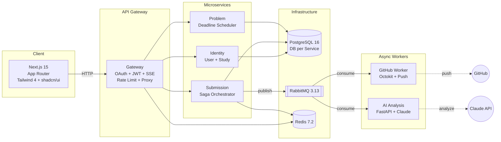

<div align="center">
  
  <h1>AlgoSu Portfolio</h1>
  <p><strong>알고리즘 스터디 관리 플랫폼</strong> — 코드 제출 &rarr; GitHub Push &rarr; AI 분석 &rarr; 코드 리뷰 자동화</p>

  [](https://github.com/tpals0409/AlgoSu/actions/workflows/ci.yml)
  
  
  -blue)
  
  

  **기간**: 2026.02.28 ~ 진행 중 (18일간 381커밋, 일 평균 21커밋)
</div>

---

## 목차

- [A. 배경 & 동기](#a-배경--동기)
- [B. 기술 결정 ("Why X over Y")](#b-기술-결정-why-x-over-y)
- [C. 아키텍처 실제 데이터](#c-아키텍처-실제-데이터)
- [D. 도전 & 교훈](#d-도전--교훈)
- [E. 코드 스니펫](#e-코드-스니펫)
- [F. 통계](#f-통계)

---

## A. 배경 & 동기

### A1. 스터디 규모

- 소규모 알고리즘 스터디 그룹 대상 (수~십여 명 단위)
- AI 분석 일일 Quota: **5회/유저/일** (Redis 원자적 INCR 기반)
- RabbitMQ prefetch=2, HPA max 3 replicas — 소규모 트래픽에 최적화된 설계

### A2. AI 도입 전 Pain Point

| # | Pain Point | 설명 |
|---|-----------|------|
| 1 | **수동 코드 리뷰 병목** | 스터디원 코드를 사람이 직접 리뷰 — 시간 소요 + 리뷰 품질 편차 |
| 2 | **GitHub Push 수작업** | 코드 제출 후 별도로 GitHub에 직접 push — 누락, 지연 빈번 |
| 3 | **진행 현황 추적 불가** | 누가 어떤 문제를 풀었는지, 분석 결과는 어떤지 한눈에 파악 불가 |

### A3. AI 도입 후 변화

- 코드 제출 → GitHub Push → AI 분석 **전 과정 자동화** (Saga Orchestrator)
- AI 분석 결과 **실시간 SSE 스트리밍** (30초 하트비트)
- Circuit Breaker로 **AI 장애 시에도 서비스 유지** (Graceful Degradation → `status=DELAYED`)
- 5개 카테고리(정확성·효율성·가독성·구조·Best Practice) **구조화된 코드 리뷰** 자동 생성

### A4. 프로젝트 수치

| 항목 | 수치 |
|------|------|
| 총 커밋 | 381개 (18일) |
| 테스트 | 2,352건 (115파일) |
| 커버리지 | Gateway branches 97.79% |
| 마이크로서비스 | 6개 + 프론트엔드 1개 |
| CI/CD jobs | 15개 (matrix 활용) |
| 스프린트 | 51회 완료 |

---

## B. 기술 결정 ("Why X over Y")

### B1. FastAPI + NestJS 동시 사용

| 서비스 | 프레임워크 | 선택 이유 |
|--------|-----------|----------|
| Gateway, Identity, Submission, Problem | **NestJS 10** | DI + 데코레이터 패턴, TypeORM 일관성, JWT/Rate Limit 내장 |
| AI Analysis | **FastAPI** | Claude `anthropic` SDK Python 공식 지원, pydantic 응답 파싱, 스레드 기반 워커 |
| GitHub Worker | **Node.js (ts-node)** | `@octokit/rest` 생태계, amqplib 경량 소비자 |

> **핵심**: AI Analysis만 Python인 이유는 **Claude SDK의 Python 우선 지원** + **ML/AI 생태계 친화성**.
> 나머지는 NestJS로 통일하여 TypeORM, DI, 미들웨어 파이프라인의 **일관성** 확보.

### B2. Saga Pattern — 실제 시나리오

```
코드 제출 → DB 저장(DB_SAVED) → GitHub Push 큐(GITHUB_QUEUED)
  → AI Quota 체크 → AI 분석 큐(AI_QUEUED) → 완료(DONE)
```

**보상 트랜잭션 3종:**

| 실패 지점 | 보상 전략 |
|----------|----------|
| GitHub Push 실패 (TOKEN_INVALID) | AI 스킵 → DONE 직행 |
| GitHub Push 실패 (FAILED/SKIPPED) | GitHub 상태 보존 + AI 분석 계속 진행 |
| AI 분석 실패 | `status=DELAYED` → 제출 자체는 DONE 처리 |

**안전장치:**
- **낙관적 락**: `WHERE sagaStep = EXPECTED_STATE` (동시성 제어)
- **멱등성**: DB 업데이트 → MQ 발행 순서 필수 + Redis idempotency key (TTL 1h)
- **타임아웃 재개**: 2분 주기 체크 (DB_SAVED 5분, GITHUB 15분, AI 30분)
- **서비스 재시작**: `onModuleInit()`에서 1시간 이내 미완료 Saga 자동 재개

### B3. k3s 선택 (vs EKS/GKE)

| 기준 | k3s | EKS/GKE |
|------|-----|---------|
| **비용** | OCI ARM 프리티어 (4 OCPU, 24GB) — **$0/월** | 최소 $70+/월 |
| **리소스** | 바이너리 50MB, 메모리 512MB로 구동 | Control Plane만 수 GB |
| **기능** | HPA, PDB, NetworkPolicy, SecurityContext 모두 지원 | 동일 |
| **배포** | ArgoCD v3.3.2 + GitOps 완전 자동화 | 동일 가능 |

> **결론**: 프리티어 ARM 환경에서 **프로덕션급 K8s 기능을 $0으로** 운영.
> EKS 대비 기능 손실 없이 비용 100% 절감.

### B4. RabbitMQ 선택 (vs Kafka)

| 기준 | RabbitMQ | Kafka |
|------|----------|-------|
| **메시지 패턴** | Task Queue (1:1 소비) — 제출 처리에 적합 | Event Stream (1:N) — 과설계 |
| **리소스** | 128Mi~512Mi — ARM 프리티어 적정 | 최소 1GB+ JVM 힙 |
| **DLQ** | 내장 DLX → DLQ 자동 라우팅 | 별도 구현 필요 |
| **운영** | 단일 노드 충분 | ZooKeeper/KRaft 필요 |

**실제 큐 구조:**
```
submission.events (Topic Exchange)
├── submission.github_push → GitHub Worker (prefetch=2)
├── submission.ai_analysis → AI Analysis Worker
└── submission.events.dlx (Dead Letter Exchange)
    ├── github_push.dlq
    └── ai_analysis.dlq
```

### B5. 에이전트 오케스트레이션 — 자체 구현

n8n, LangChain 등 외부 도구 미사용. **12개 Agent 페르소나를 Claude Code 슬래시 커맨드로 직접 구현:**

```
agents/
├── _shared/persona-base.md      # 공통 규칙 (보안, 코드, 보고 체계)
├── oracle/persona.md            # 심판관 — 최종 기획 결정
├── architect/persona.md         # 기반설계자 — k3s, CI/CD
├── conductor/persona.md         # 지휘자 — 배포 파이프라인
├── gatekeeper/persona.md        # 관문지기 — 인증/보안
├── postman/persona.md           # 배달부 — API 설계
├── curator/persona.md           # 출제자 — 문제 도메인
├── scribe/persona.md            # 서기관 — Saga 오케스트레이션
├── palette/persona.md           # 팔레트 — UI/UX
├── sensei/persona.md            # 분석가 — AI 파이프라인
├── herald/persona.md            # 전령 — SSE 실시간 알림
├── scout/persona.md             # 정찰병 — GitHub 연동
└── librarian/persona.md         # 기록관리자 — 문서화
```

> **이유**: 외부 워크플로우 도구 대비 **프롬프트 엔지니어링만으로 역할 분담** 가능, 추가 인프라 불필요.

---

## C. 아키텍처 실제 데이터

### C1. 마이크로서비스 목록

| 서비스 | 포트 | 프레임워크 | 핵심 기능 |
|--------|------|-----------|----------|
| **Gateway** | 3000 | NestJS 10 | OAuth (Google/Naver/Kakao), JWT, Rate Limit, API Proxy, SSE |
| **Identity** | 3004 | NestJS 10 | User CRUD, Study 관리 (34개 API, Sprint 51 신규) |
| **Submission** | 3003 | NestJS 10 | 코드 제출, Saga Orchestrator, Draft 관리 |
| **Problem** | 3002 | NestJS 10 | 문제 CRUD, 주차별 관리, Deadline 자동 종료 스케줄러 |
| **GitHub Worker** | - | Node.js (ts-node) | RabbitMQ 소비, Octokit GitHub Push, 멱등성 체크 |
| **AI Analysis** | 8000 | FastAPI (Python) | Claude API 호출, Circuit Breaker, 일일 Quota 관리 |
| **Frontend** | 3001 | Next.js 15 | App Router, React 19, Tailwind 4, shadcn/ui, Monaco Editor |

**인프라**: PostgreSQL 16 (DB per Service) · RabbitMQ 3.13 · Redis 7.2 · MinIO

### C2. API Gateway 라우팅 구조

**미들웨어 파이프라인 (실행 순서):**

```
요청 → RequestIdMiddleware (X-Request-Id, X-Trace-Id)
     → SecurityHeadersMiddleware (보안 헤더 5종)
     → RateLimitMiddleware (Redis 기반: default 60req/60s, submission 10req/60s)
     → JwtMiddleware (httpOnly Cookie JWT 검증)
     → TokenRefreshInterceptor (만료 5분 전 자동 갱신)
     → ProxyDispatchMiddleware (서비스별 X-Internal-Key 주입 + 프록시)
```

**프록시 라우팅 (화이트리스트 기반):**

| 경로 | 대상 | 인증 |
|------|------|------|
| `/api/problems/**` | Problem Service | X-Internal-Key |
| `/api/submissions/**` | Submission Service | X-Internal-Key |
| `/api/analysis/**` | AI Analysis Service | X-Internal-Key |
| `/api/studies/**` | Gateway 내부 → Identity HTTP | JWT |
| `/auth/**` | Gateway 내부 (OAuth) | - |
| `/sse/**` | Gateway 내부 (SSE) | Cookie JWT |
| `/internal/**` | Gateway 내부 (서비스 간) | X-Internal-Key |

> 미등록 경로는 `CatchAllController`에서 **404 차단** (화이트리스트 방식).

### C3. AI Pipeline 상세 흐름

```
Frontend (코드 제출)
  │ POST /api/submissions
  ▼
Gateway (JWT 검증 + 프록시)
  │ X-Internal-Key + X-User-ID 주입
  ▼
Submission Service
  ├─ DB 저장 (sagaStep=DB_SAVED)
  ├─ RabbitMQ 발행: submission.github_push
  │
  ▼
GitHub Worker (RabbitMQ 소비)
  ├─ Redis 멱등성 체크 (TTL 1h)
  ├─ Gateway Internal API → GitHub 토큰 조회
  ├─ Octokit → GitHub Push
  └─ 콜백 → Submission Service
  │
  ▼
Submission Service (Saga 진행)
  ├─ AI Analysis /quota/check (한도 체크, Redis INCR)
  ├─ 한도 내 → RabbitMQ: submission.ai_analysis
  └─ 한도 초과 → DONE (aiSkipped=true)
  │
  ▼
AI Analysis Worker (Python)
  ├─ Circuit Breaker 체크 (OPEN이면 NACK+requeue)
  ├─ Claude Haiku API 호출 (max_tokens=4096)
  ├─ JSON 파싱 (3단계 fallback: 정규식 → optimizedCode 제거 → JSON 객체 추출)
  ├─ 결과 → Submission /internal/{id}/ai-result 콜백
  └─ Redis Pub/Sub 브로드캐스트
  │
  ▼
Gateway SSE → Frontend (실시간 상태 업데이트)
```

### C4. Saga 트랜잭션 — 상태 머신

```
DB_SAVED ──(5분 timeout)──→ GITHUB_QUEUED ──(15분 timeout)──→ AI_QUEUED ──(30분 timeout)──→ DONE
                                │                                  │
                                ├─ TOKEN_INVALID → DONE (AI 스킵)  ├─ AI 실패 → DONE (delayed)
                                └─ FAILED/SKIPPED → AI 계속 진행     └─ timeout → FAILED
```

**핵심 패턴:**
- **낙관적 락**: `WHERE sagaStep = EXPECTED` (UPDATE affected=0이면 스킵)
- **멱등성 순서**: DB 업데이트 → MQ 발행 (역순 시 재시작 후 중복 발행 위험)
- **DLQ**: 3회 실패 → Dead Letter Queue 격리

### C5. 모니터링 알림 규칙

**Prometheus + Grafana + Alertmanager 3계층 (7개 메트릭 소스, 30초 스크랩):**

| 카테고리 | 알림 | 임계값 | 심각도 |
|---------|------|-------|--------|
| 가용성 | ServiceDown | 30초 무응답 | critical |
| 에러율 | HighErrorRate / CriticalErrorRate | 5xx > 5% / > 15% | warning / critical |
| 응답시간 | HighLatencyP95 | P95 > 1.0s | warning |
| 보안 | AuthFailureRateHigh | 401 > 30% | critical |
| 보안 | InternalKeyViolation | 403 > 5회/5분 | critical |
| AI | CircuitBreakerOpen | CB 열림 | critical |
| MQ | DLQReceived | DLQ 메시지 도달 | critical |
| K8s | PodRestartFrequent / OOMKilled | >3회/1h, OOM | warning / critical |

**알림 채널**: Discord webhook (성공: Green, 실패: Red), 반복 간격 1시간

### C6. CI/CD 파이프라인 (15 jobs)

```
Phase 1: 검증
  ├─ secret-scan (gitleaks + .env 검증)
  ├─ detect-changes (dorny/paths-filter → 변경 서비스만 감지)
  └─ commit-lint (Conventional Commits)

Phase 2: 품질
  ├─ quality-node (matrix 5개: ESLint + TypeScript typecheck)
  ├─ quality-ai-analysis (ruff lint + format)
  └─ quality-frontend (next lint + TypeScript)

Phase 3: 테스트
  ├─ test-node (matrix 5개: --coverage --ci)
  ├─ test-ai-analysis (pytest --cov)
  └─ test-frontend (--coverage)

Phase 4: 빌드
  ├─ build-services (matrix 6개: Docker ARM64, ghcr.io, GHA cache)
  └─ build-frontend (Next.js ARM64)

Phase 5: 보안 (main만)
  └─ trivy-scan (matrix 7개: CRITICAL/HIGH → SARIF → GitHub CodeQL)

Phase 6: 배포 (main + 보안 통과)
  └─ deploy (aether-gitops kustomization.yaml 업데이트 → ArgoCD auto-sync)

Phase 7: 알림
  └─ notify (Discord embed + Grafana annotation)
```

**핵심 특징:**
- **경로 필터**: 변경된 서비스만 테스트/빌드 (CI 비용 절감)
- **ARM64 크로스컴파일**: QEMU + GHA 캐시 (OCI 프리티어 대응)
- **Immutable 태그**: `main-{SHA}` (latest 절대 금지)
- **최소 권한**: 기본 `permissions: {}`, job별 필요 권한만 명시

### C7. 아키텍처 다이어그램



---

## D. 도전 & 교훈

### D1. 가장 어려웠던 기술적 문제

#### 1) 마감 문제 실종 버그 (Sprint 49-50)

- **증상**: 마감 자동 종료 스케줄러는 정상 작동했으나, `status=ACTIVE` 필터로 마감(CLOSED) 문제가 목록에서 완전히 사라짐
- **원인**: `delete()` 메서드가 `status=CLOSED`로 설정 → 마감과 삭제 상태 구분 불가
- **해결**: `ProblemStatus.DELETED` 별도 enum 추가 + 필터를 `Not(In([DRAFT, DELETED]))` 방식으로 전환
- **교훈**: **포함 필터 → 제외 필터** 패턴이 더 안전, soft delete는 전용 상태가 필요

#### 2) Gateway → Identity DB 직접 접근 (Sprint 51)

- **증상**: Gateway가 `identity_db`에 TypeORM 직접 접근 (19파일, 6엔티티) — **DB per Service 원칙 위반**
- **해결**: Identity 서비스에 **34개 API 신규 구축** + Gateway를 IdentityClientService HTTP 호출로 전환
- **규모**: Entity 4개 삭제, 597개 테스트 수정, ADR-001 문서화
- **교훈**: **데이터 소유권은 프로젝트 초기에 확정** 필요

#### 3) Guard 403 간헐적 오류 (Sprint 40)

- **증상**: 장시간 Pod의 stale Redis 연결 → silent 403 (로그 없음)
- **해결**: role 검증 실패 시 warn 로깅 추가 + 캐시 히트 시에도 role 유효성 재검증
- **교훈**: **캐시 레이어는 주기적 유효성 검증 필수**, silent failure 금지

### D2. 초기 설계에서 크게 바뀐 부분

| 변경 사항 | 상태 | ADR |
|----------|------|-----|
| Gateway → Identity DB 분리 (19파일 리팩터링, 34 API 신규) | **완료** | ADR-001 |
| Outbox 패턴 검토 → 낙관적 락 + 타임아웃 재개로 대체 (리소스 제약) | **보류** | ADR-002 |
| Redis/RabbitMQ 서비스별 ACL 분리 | **제안** | ADR-003 |

> ADR-002 **보류 근거**: OCI ARM 4OCPU/24GB에서 CDC(Debezium) 리소스 과다.
> 현재 트래픽(스터디 단위, 수십 명)에서 낙관적 락 + 타임아웃 재개로 **충분한 안정성** 확보.

### D3. 장애 대응 경험

- **GitHub App Key 로테이션 런북**: 분기별 키 교체 프로세스 문서화 (긴급 시 즉시 Revoke + ArgoCD 수동 sync)
- **DB 마이그레이션 런북**: `statement_timeout=200ms` 환경에서 ALTER TABLE 대응 (세션 단위 해제, `CREATE INDEX CONCURRENTLY`)
- **CI/CD force-push 사고**: amend 커밋이 `dorny/paths-filter` 감지 누락 → **force-push(amend) 금지** 정책 수립

### D4. 성능 최적화 사례

| 영역 | Before | After |
|------|--------|-------|
| **DB Connection Pool** | TypeORM 기본 max=10 (4서비스 x 10 = 40) | max=5/서비스 (총 20, ARM 적정) |
| **HPA** | 고정 1 replica | CPU 70% 기준 자동 스케일링 (1~3) |
| **Circuit Breaker** | API 장애 시 전체 서비스 영향 | 5회 실패 → OPEN → 30초 후 복구 시도 |
| **CI jobs** | 24개 | 15개 (-37.5%, matrix 활용) |
| **캐시 검증** | 캐시 히트 시 무조건 신뢰 | role 유효성 재검증 (Guard 403 교훈) |

### D5. 처음부터 다시 한다면

1. **데이터 소유권 초기 확정** — Gateway가 identity_db 접근하는 실수 방지 (Sprint 51 full refactor 필요했음)
2. **OpenAPI/Swagger 의무화** — 서비스 간 contract 불일치 (weekNumber NULL 등) 원천 방지
3. **Outbox 패턴 초기 도입** — DB+MQ 비원자성 문제를 리소스 제약과 무관하게 설계
4. **per-service 자격증명** — Redis/RabbitMQ 동일 자격증명으로 시작한 점
5. **TDD** — Guard/middleware 테스트를 Sprint 40에서야 보강한 점

---

## E. 코드 스니펫

### E1. Saga Orchestrator — 분산 트랜잭션 관리

> `services/submission/src/saga/saga-orchestrator.service.ts` (425줄)

```typescript
/**
 * Saga Orchestrator -- 제출 플로우 상태 관리
 * 플로우: DB_SAVED -> GITHUB_QUEUED -> (quota check) -> AI_QUEUED | AI_SKIPPED -> DONE
 *
 * 멱등성 보장 순서 (필수):
 * 1. DB 업데이트 (saga_step 갱신) -- 먼저
 * 2. RabbitMQ 발행 -- 나중
 * -> 역순 시 서비스 재시작 후 중복 발행 위험
 */
@Injectable()
export class SagaOrchestratorService implements OnModuleInit, OnModuleDestroy {

  // 단계별 타임아웃
  private static readonly STEP_TIMEOUTS: Record<SagaStep, number> = {
    [SagaStep.DB_SAVED]: 5 * 60 * 1000,       // 5분
    [SagaStep.GITHUB_QUEUED]: 15 * 60 * 1000,  // 15분
    [SagaStep.AI_QUEUED]: 30 * 60 * 1000,      // 30분
  };

  // Startup Hook -- 미완료 Saga 자동 재개
  async onModuleInit(): Promise<void> {
    const oneHourAgo = new Date(Date.now() - 60 * 60 * 1000);
    const incompleteSubmissions = await this.submissionRepo.find({
      where: {
        sagaStep: Not(In([SagaStep.DONE, SagaStep.FAILED, SagaStep.AI_SKIPPED])),
        createdAt: MoreThan(oneHourAgo),
      },
    });
    for (const submission of incompleteSubmissions) {
      await this.resumeSaga(submission);
    }
  }

  // 낙관적 락 + 멱등성
  async advanceToGitHubQueued(submissionId: string): Promise<void> {
    const result = await this.submissionRepo.update(
      { id: submissionId, sagaStep: SagaStep.DB_SAVED },  // WHERE 조건
      { sagaStep: SagaStep.GITHUB_QUEUED },
    );
    if (result.affected === 0) return;  // 이미 진행 중 → 스킵
    await this.mqPublisher.publishGitHubPush({ submissionId, ... });
  }

  // AI Quota 체크 → 한도 초과 시 AI_SKIPPED
  async advanceToAiQueued(submissionId: string): Promise<void> {
    const quotaAllowed = await this.checkAiQuota(submission.userId);
    if (!quotaAllowed) {
      await this.submissionRepo.update(
        { id: submissionId, sagaStep: SagaStep.GITHUB_QUEUED },
        { sagaStep: SagaStep.DONE, aiSkipped: true },
      );
      return;
    }
    // ... AI 큐 발행
  }

  // 보상 트랜잭션: GitHub 실패
  async compensateGitHubFailed(submissionId: string, syncStatus: GitHubSyncStatus): Promise<void> {
    if (syncStatus === GitHubSyncStatus.TOKEN_INVALID) return;  // AI 스킵
    await this.advanceToAiQueued(submissionId, true);  // AI 분석 계속
  }
}
```

### E2. Circuit Breaker — Claude API 보호

> `services/ai-analysis/src/circuit_breaker.py` (115줄)

```python
class CircuitBreaker:
    """
    CLOSED → OPEN (연속 5회 실패)
    OPEN → HALF_OPEN (30초 경과)
    HALF_OPEN → CLOSED (2회 연속 성공) 또는 OPEN (1회 실패)
    """
    def __init__(self, failure_threshold=5, recovery_timeout=30, half_open_requests=2):
        self.state = CircuitState.CLOSED
        self.failure_count = 0

    @property
    def is_open(self) -> bool:
        if self.state == CircuitState.OPEN:
            if time.time() - self.last_failure_time >= self.recovery_timeout:
                self.state = CircuitState.HALF_OPEN  # 복구 시도
                self._notify_state_change()          # Prometheus gauge 업데이트
                return False
            return True
        return False

    def record_success(self) -> None:
        if self.state == CircuitState.HALF_OPEN:
            self.half_open_successes += 1
            if self.half_open_successes >= self.half_open_requests:
                self.state = CircuitState.CLOSED  # 정상화
                self._notify_state_change()

    def record_failure(self) -> None:
        self.failure_count += 1
        if self.state == CircuitState.HALF_OPEN:
            self.state = CircuitState.OPEN  # 복구 실패
        elif self.failure_count >= self.failure_threshold:
            self.state = CircuitState.OPEN  # 차단
```

### E3. CI/CD YAML 핵심

> `.github/workflows/ci.yml` (892줄)

**1) 모노레포 경로 기반 변경 감지:**
```yaml
detect-changes:
  steps:
    - uses: dorny/paths-filter@v3
      with:
        filters: |
          gateway: ['services/gateway/**']
          submission: ['services/submission/**']
          # ... 변경된 서비스만 빌드 → CI 비용 절감
```

**2) ARM64 크로스컴파일 + Immutable 태그:**
```yaml
build-services:
  steps:
    - uses: docker/setup-qemu-action@v3
      with: { platforms: linux/arm64 }
    - uses: docker/build-push-action@v5
      with:
        platforms: linux/arm64
        tags: ghcr.io/tpals0409/algosu-${{ matrix.service }}:main-${{ github.sha }}
        cache-from: type=gha,scope=${{ matrix.service }}
```

**3) Trivy 보안 스캔 → GitHub CodeQL 통합:**
```yaml
trivy-scan:
  steps:
    - run: trivy image --severity CRITICAL,HIGH --exit-code 1 --platform linux/arm64
    - run: trivy image --format sarif --output trivy-results.sarif
    - uses: github/codeql-action/upload-sarif@v3
```

**4) GitOps 자동 배포:**
```yaml
deploy:
  if: needs.secret-scan.result == 'success' && needs.trivy-scan.result != 'failure'
  steps:
    - name: Update image tags in aether-gitops
      run: |
        python3 -c "
        for img in data.get('images', []):
            if 'algosu-${SVC}' in img.get('name', ''):
                img['newTag'] = 'main-${SHA}'
        "
    - run: git commit -m "deploy(algosu): update image tags" && git push
    # → ArgoCD auto-sync → k3s 배포
```

---

## F. 통계

### F1. 배포 기간

| 항목 | 수치 |
|------|------|
| 총 커밋 | **381개** |
| 배포 관련 커밋 | **86개** (23%) |
| 프로젝트 기간 | **18일** (2026-02-28 ~ 2026-03-18) |
| 일 평균 커밋 | **~21개/일** |
| 일 평균 배포 | **~4.8회/일** |

### F2. 테스트 분포 (2,352건)

| 서비스 | 테스트 파일 | 테스트 수 | 유형 |
|--------|-----------|----------|------|
| Gateway | 42개 | 545건 | Unit + Integration |
| Identity | 15개 | 97건 | Unit + Integration |
| Submission | 17개 | 211건 | Unit + Integration |
| Problem | 13개 | 143건 | Unit + Integration |
| GitHub Worker | 7개 | 96건 | Unit + Integration |
| AI Analysis | - | 50건 | pytest (Unit) |
| Frontend | 21개 | 1,210건 | Unit (hooks, lib) |
| **합계** | **115+** | **2,352건** | |

E2E: `docker-compose.dev.yml` 기반, `workflow_dispatch` 수동 트리거

### F3. 커버리지 (4가지 메트릭 전체 측정)

| 서비스 | Branches | Functions | Lines | Statements |
|--------|----------|-----------|-------|------------|
| **Gateway** | **95% (실측 97.79%)** | 97% | 98% | 98% |
| Identity | 98% | 98% | 98% | 98% |
| Submission | 92% | 96% | 97% | 97% |
| Problem | 96% | 98% | 98% | 98% |
| GitHub Worker | 92% | **100%** | 98% | 98% |
| Frontend | 80% | 88% | 86% | 86% |

> **97.79%**는 Gateway의 **Branches 실측값** (CI 임계값 95% 대비).

### F4. 인프라 수치

| 항목 | 수치 |
|------|------|
| **HPA 최대 Pod** | 9개 (3서비스 x max 3) |
| **서비스 메모리** | 256Mi req / 400Mi limit |
| **서비스 CPU** | 100m req / 500m limit |
| **배포 전략** | RollingUpdate (maxUnavailable=0, maxSurge=1) |
| **Health Probe** | Liveness 10-15s/10s, Readiness 5s/5s |
| **Security** | runAsNonRoot, readOnlyRootFilesystem, drop ALL |
| **Prometheus** | 7 소스, 30초 스크랩, 7일 TSDB 보존 |
| **Rate Limit** | 60req/60s (default), 10req/60s (submission) |
| **AI Quota** | 5회/유저/일 |
| **NetworkPolicy** | 서비스별 Ingress/Egress 격리 |
| **PDB** | Gateway, Identity, Submission: minAvailable=1 |

---

<div align="center">
  <sub>Built with NestJS · FastAPI · Next.js 15 · PostgreSQL · RabbitMQ · Redis · k3s · ArgoCD</sub>
</div>
